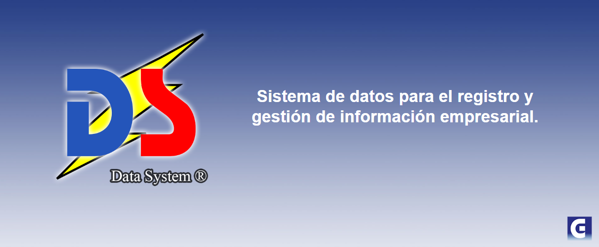
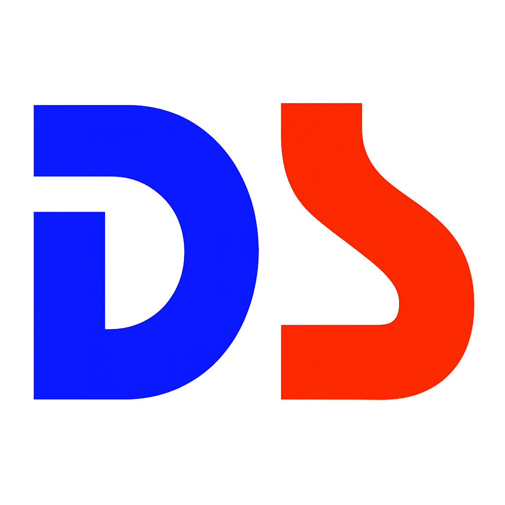

)

)


# DataSystem

## 1. Introducción al Proyecto

Este repositorio alberga el código y la documentación de DataSystem, una aplicación de escritorio diseñada como parte del proyecto final del Curso de Programación Java Intermedio. Este curso fue impartido por el canal educativo "La Geekipedia De Ernesto", y su objetivo principal es proporcionar a los estudiantes un enfoque práctico sobre cómo desarrollar aplicaciones reales utilizando Java.

DataSystem está diseñado como un software de gestión para pequeñas y medianas empresas, con el fin de facilitar la administración de la relación con los clientes, el inventario de equipos tecnológicos, y el seguimiento del servicio técnico de los mismos. La aplicación está orientada a la gestión de la reparación y mantenimiento de equipos, así como a la administración de los datos de los clientes de manera eficiente.

Además de ser un recurso de aprendizaje integral, este proyecto tiene la intención de fomentar la colaboración abierta. Esto permite que los desarrolladores interesados puedan contribuir con sus propias mejoras y ampliaciones del proyecto, adaptándolo a sus necesidades o implementando nuevas características. El sistema está estructurado de manera modularizada, lo que facilita la incorporación de nuevas funcionalidades sin afectar al núcleo principal de la aplicación.


---

 

## 2. Arquitectura y Stack Tecnológico

El proyecto está diseñado sobre una arquitectura de aplicación de escritorio monolítica, haciendo uso de tecnologías estándar de Java para la interfaz y un motor de base de datos relacional para la persistencia.

### 2.1 Tecnologías Clave

| Componente | Tecnología | Versión/Detalle | Función y Propósito |
| :--- | :--- | :--- | :--- |
| **Lenguaje Base** | Java (JDK) | Versión 8 o superior | Implementación de la lógica de negocio y el control de flujo. |
| **Interfaz (View)** | Java Swing | Biblioteca nativa de Java SE | Construcción de la Interfaz Gráfica de Usuario (GUI) del sistema. |
| **Persistencia** | MySQL | Motor de Base de Datos Relacional | Almacenamiento seguro y transaccional de todos los datos del sistema (usuarios, clientes, equipos). |
| **Conectividad** | JDBC Connector | Driver de Java | Gestión de la capa de acceso a datos (DAO), permitiendo la comunicación entre Java y MySQL. |
| **Reportes** | iTextPDF Library | Librería externa (JAR) | Funcionalidad para generar y exportar reportes de datos y listados de equipos en formato PDF. |
| **Entorno** | NetBeans IDE | Preferentemente última LTS | Plataforma utilizada para el desarrollo, compilación y gestión de dependencias del proyecto. |

### 2.2 Estructura del Código Fuente

La estructura del código fuente está diseñada para albergar múltiples versiones del proyecto. Todos los paquetes de clases residen dentro de un subdirectorio en `src/` que lleva el nombre del alias del desarrollador (`src/[Alias_Desarrollador]/`).

Esta convención es obligatoria para:
* **Aislamiento de Código:** Prevenir conflictos de *namespace* y *classpath* entre distintas implementaciones.
* **Atribución Clara:** Vincular inequívocamente el código fuente a su contribuidor.


---

 

## 3. Funcionalidades Detalladas de DataSystem

El **DataSystem** maneja el ciclo de vida completo del servicio técnico:

| Módulo | Funcionalidad | Descripción |
| :--- | :--- | :--- |
| **Seguridad/Acceso** | Autenticación basada en Roles | Sistema de *login* que diferencia el acceso de usuarios entre los roles: **Administrador**, **Capturista** y **Técnico**, lo que determina los permisos de visualización y edición dentro del sistema. |
| **Clientes** | Gestión Integral (CRUD) | Permite la creación, consulta, modificación y eliminación de registros de clientes, incluyendo datos de contacto. Funcionalidad principal para los roles de **Administrador** y **Capturista**. |
| **Equipos** | Registro con Trazabilidad | Almacenamiento de información técnica del equipo (marca, tipo, número de serie) y su estatus de servicio actual. |
| **Servicio Técnico** | Seguimiento de Estatus | Actualización y seguimiento del progreso de la reparación o servicio (e.g., 'En Revisión', 'Reparado', 'Entregado'). Historial de estatus asociado a cada equipo. Funcionalidad principal para el rol de **Técnico**. |
| **Reportes** | Generación de Documentos | Exportación de listados filtrados de clientes y equipos a documentos PDF formales utilizando la librería iTextPDF. Exclusivo para el rol de **Administrador**. |
| **Estadísticas** | Visualización Gráfica | Muestra gráficos estadísticos (generalmente gráficos circulares o de pastel) sobre el estado actual de los equipos en servicio. |


---

 

## 4. Proceso de Despliegue y Configuración

Para que la aplicación principal de DataSystem funcione correctamente, es necesario asegurar la configuración del entorno de desarrollo y la base de datos.

### 4.1 Requisitos Previos y Enlaces de Descarga

Para asegurar un despliegue y desarrollo exitoso, instale las siguientes dependencias esenciales:

* **Java Development Kit (JDK 8+):** Necesario para compilar y ejecutar el código. Se recomienda la versión LTS más reciente, como JDK 21.
    * [Descargar JDK / OpenJDK (Oracle)](https://www.oracle.com/java/technologies/downloads/) o [Descargar Adoptium Temurin (Recomendado)](https://adoptium.net/temurin/releases/)

* **NetBeans IDE:** El entorno de desarrollo recomendado para este proyecto. Se sugiere la última versión estable.
    * [Descargar Apache NetBeans (Última versión estable)](https://netbeans.apache.org/download/index.html)

* **Servidor MySQL Local:** Para la persistencia de datos. Se recomienda la suite **XAMPP** o **WAMP**, que integra MySQL (o MariaDB) y PHPMyAdmin.
    * [Descargar XAMPP (Recomendado para Windows/Linux/OS X)](https://www.apachefriends.org/es/download.html)

### 4.2 Configuración de la Persistencia (MySQL)

Es imperativo que la base de datos se configure **antes de la primera ejecución** de la aplicación:

1.  **Servicios:** Inicie los servicios de **MySQL** y **Apache** a través de su panel de control (XAMPP/WAMP).
2.  **Esquema:** Acceda a su gestor de bases de datos (PHPMyAdmin o similar) y cree un esquema con el nombre **exacto**: `bd_ds`.
3.  **Carga de Datos Iniciales:** Importe el *script* SQL que se encuentra en el directorio `database/` del repositorio. Este *script* define la estructura de las tablas y los usuarios iniciales necesarios para el *login*.

### 4.3 Gestión de Dependencias JAR

El proyecto requiere dependencias externas (`.jar` files) que deben ser añadidas manualmente al *classpath* del proyecto en NetBeans:

| Dependencia | Propósito | Versión Sugerida | Enlace de Descarga (JAR) |
| :--- | :--- | :--- | :--- |
| **MySQL Connector/J** | Para establecer la conexión JDBC. | Versión más reciente | [Descargar JDBC Connector](https://dev.mysql.com/downloads/connector/j/) |
| **iTextPDF** | Para funcionalidades de exportación a PDF. | iText 5.5.x (Licencia AGPL) | [Descargar iTextPDF 5.5.9 JAR](https://jar-download.com/artifacts/com.itextpdf/itextpdf/5.5.9/source-code) |

> **Instrucción de Instalación:** Estas librerías deben ser descargadas externamente y añadidas a la carpeta **"Librerías"** o **"Libraries"** del proyecto en NetBeans, utilizando la opción "Add JAR/Folder..." o "Añadir JAR/Carpeta...".

### 4.4 Ejecución del Código Fuente

**Paso Crucial para Colaboradores:**

1.  **Clonar el repositorio:** Si aún no lo ha hecho, use el `sparse-checkout` como se detalla en la sección **5.1** para solo descargar su paquete.
    ```bash
    git clone --no-checkout [https://github.com/ESRG-es/DataSystem.git](https://github.com/ESRG-es/DataSystem.git)
    git sparse-checkout set src/<TU_ALIAS>
    ```
2.  **Abrir el proyecto** en NetBeans.
3.  **Configuración de Rutas:** Asegúrese de que el IDE reconozca la ruta `src/` como la carpeta raíz de los paquetes fuente.
4.  **Verificación:** Asegúrese de que el IDE no reporte errores de dependencia (JARs) o de conexión a la base de datos (pasos 4.2 y 4.3).
5.  **Ejecución:** Ejecute la aplicación (clase principal).

> **Nota para NetBeans:** Si está desarrollando una funcionalidad dentro de su paquete (`src/[TuAlias]/`), debe establecer la **clase principal** de su módulo para probar su código. Para ejecutar el proyecto completo, debe asegurarse de que la clase principal esté configurada correctamente en el proyecto global.


---

 

## 5. Protocolo de Colaboración

El desarrollo de DataSystem se estructura bajo un esquema de **colaboración por paquete**. Este modelo está diseñado para mantener una alta organización y evitar conflictos de código a medida que crece el equipo.

Cada desarrollador trabaja de manera **autónoma** y exclusiva dentro de una carpeta propia ubicada en el directorio raíz `src/`, utilizando su alias como nombre de la carpeta:

```
   src/  
   ├── geekipedia-ernesto/  
   ├── ESRG/
   ├── TuAlias/
   └── images/
```

Este estricto aislamiento por paquete garantiza:
* **Organización Clara:** El código de cada colaborador es fácilmente identificable.
* **Evita Conflictos:** Se minimiza el riesgo de conflictos al mezclar ramas (*merge conflicts*) en archivos compartidos.
* **Comparación Sencilla:** Permite a los revisores comparar implementaciones y funcionalidades sin que el código de diferentes autores esté mezclado.

### 5.1 Clonar solo tu paquete (Sparse Checkout)

Dado que el repositorio puede contener múltiples versiones y paquetes de gran tamaño, **no es necesario descargar todo el historial ni el código completo**. Recomendamos enfáticamente el uso de `git sparse-checkout` para optimizar tu entorno local.

Para trabajar únicamente en tu carpeta y ahorrar espacio y tiempo de descarga:

1. Clonar el repositorio sin descargar archivos (solo la estructura)
```bash
git clone --no-checkout [https://github.com/ESRG-es/DataSystem.git](https://github.com/ESRG-es/DataSystem.git)
```
2. Entrar al directorio
```bash
cd DataSystem
```
3. Inicializar el sparse-checkout en modo cono (más eficiente)
```bash
git sparse-checkout init --cone
```
4. Especificar solo tu carpeta/paquete para descargar
```bash
git sparse-checkout set src/<TU_ALIAS>
```
Esto descargará exclusivamente los contenidos de:
> src/<TU_ALIAS>/

Todos los demás paquetes y directorios del proyecto no se descargarán, no ocuparán espacio en tu disco local, ni se mostrarán en tu explorador de archivos, manteniendo tu entorno de trabajo limpio.

### 5.2 Crear tu paquete (solo la primera vez)
Si es tu primera contribución al proyecto, debes crear tu paquete inicial y registrarlo en el repositorio central:

1. Crear el directorio de tu paquete dentro de src/
```bash
mkdir -p src/<TU_ALIAS>
```
2. Comienza a añadir tus archivos (e.g., código, documentación específica)
```bash
# Ejemplo: src/<TU_ALIAS>/package/ o src/<TU_ALIAS>/codigo.java
```
3. Registrar tu nuevo paquete en Git
```bash
git add src/<TU_ALIAS>
```
4. Crear el commit de adición
```bash
git commit -m "feat(package): Añadir paquete inicial de <TU_ALIAS>"
```
5. Subir la carpeta al repositorio remoto (branch principal)
```bash
git push origin main
```
El repositorio remoto integrará tu nueva carpeta sin interferir con los paquetes existentes de otros desarrolladores.

### 5.3 Reglas de trabajo y colaboración
El éxito de la colaboración por paquete depende de la adherencia a las siguientes reglas:

Alcance Estricto: Cada colaborador solo debe modificar archivos dentro de su propia carpeta:

> src/<TU_ALIAS>/

Inviolabilidad: No se permite editar, eliminar, renombrar o mover código, directorios o archivos de otros autores. Si necesitas una funcionalidad de otro paquete, debes llamarla (importarla), no modificarla.

Encapsulamiento: Nuevas funcionalidades, features, o refactorizaciones de código deben estar completamente encapsuladas dentro de tu paquete.

Pull Requests (PRs): Todos los pull requests de contribución deben tocar exclusivamente archivos y directorios dentro de src/<TU_ALIAS>/.

### 5.4 Actualizar tu copia local sin descargar todo
Para sincronizar tu copia local con los últimos cambios del repositorio (upstream) sin traer todos los paquetes de otros desarrolladores que Git podría ignorar, usa el siguiente comando:

```bash
git pull --no-rebase
```

Gracias al sparse checkout, tu copia local únicamente actualizará los cambios que ocurran en tu carpeta (src/<TU_ALIAS>/) y en los archivos raíz del proyecto (como el propio README.md), manteniendo el entorno ligero y rápido.

### 5.5 Registro de Contribuidores (CONTRIBUTORS.md)
Para mantener un reconocimiento transparente de todos los desarrolladores que forman parte de DataSystem, el repositorio cuenta con un archivo central llamado CONTRIBUTORS.md en la raíz del proyecto.

Reglas de registro:
Momento del registro: Al crear tu paquete inicial (paso 5.2), debes añadir tu nombre o alias a este archivo.

Formato: Utiliza una lista de Markdown que incluya tu alias y, opcionalmente, un enlace a tu perfil de GitHub:

Markdown

- [TuAlias](https://github.com/TuUsuario)
Ubicación: Añade tu nombre al final de la lista existente para evitar conflictos de mezcla (merge conflicts) con otros registros recientes.

Ejemplo de actualización:
Cuando realices tu primer commit de estructura, incluye la modificación del archivo:

# 1. Editar el archivo CONTRIBUTORS.md y añadir tu alias
# 2. Registrar el cambio junto con tu paquete
```bash
git add src/<TU_ALIAS> CONTRIBUTORS.md
```
```bash
git commit -m "feat: añadir paquete de <TU_ALIAS> y registro en CONTRIBUTORS"
```
```bash
git push origin main
```
> Nota: A diferencia de tu carpeta en src/, el archivo CONTRIBUTORS.md es uno de los pocos archivos compartidos que todos los colaboradores están autorizados a editar exclusivamente para añadir su propia información.


---

 

## 6. Reconocimiento y Apoyo

### 6.1 Atribución del Contenido Original

El código base de **DataSystem** ha sido creado como parte de un proyecto educativo del **Curso de Programación Java Intermedio**, dictado por **Ernesto**, creador del canal educativo **La Geekipedia De Ernesto**. Todo el material relacionado con el desarrollo de este proyecto y los conceptos que se cubren, provienen directamente de dicho curso, el cual es una excelente fuente para quienes desean aprender a programar en Java a un nivel intermedio.

**La Geekipedia De Ernesto** es un canal de YouTube dedicado a la enseñanza de diversos temas relacionados con la informática, el desarrollo de software y otras áreas tecnológicas, ofreciendo tutoriales completos, proyectos prácticos y guías fáciles de seguir.

Los recursos principales utilizados para este proyecto se encuentran en las siguientes plataformas:

* **Canal de YouTube:** [La Geekipedia De Ernesto](https://www.youtube.com/@LaGeekipediaDeErnesto)  
   Aquí se publican videos tutoriales y otros contenidos educativos. Es una excelente fuente para aprender desde lo más básico hasta temas más avanzados de programación.

* **Recurso Principal (Lista de Reproducción del Curso):**  
   [Curso de Programación JAVA Intermedio](https://www.youtube.com/playlist?list=PLyvsggKtwbLXEZjb8HrNTbWesTKIfpNak)  
   Esta lista de reproducción contiene todos los videos del curso que cubren desde los fundamentos de Java hasta cómo construir aplicaciones completas como **DataSystem**. Los videos son muy útiles para quienes quieran seguir el curso paso a paso y entender el proceso completo de desarrollo.

Es importante mencionar que todo el contenido del código y el enfoque del proyecto es derivado de estas fuentes, por lo que el reconocimiento debe dirigirse a **Ernesto** por su labor educativa.

### 6.2 Apoyo al Creador de Contenido

Si has encontrado útil este curso y el código proporcionado, y deseas contribuir para que **Ernesto** continúe creando contenido educativo y ofreciendo recursos gratuitos para la comunidad, puedes apoyar su trabajo a través de una donación. Cualquier aporte será apreciado y ayudará a que más personas puedan beneficiarse de sus tutoriales y proyectos educativos.

**Plataforma de Donación (PayPal):**  
A través de este enlace podrás realizar una contribución voluntaria para apoyar a **Ernesto**. El apoyo de la comunidad es fundamental para que proyectos educativos como este sigan adelante y para que más recursos sean creados y compartidos con estudiantes de todo el mundo.

* **Enlace de PayPal:** https://www.paypal.me/LaGeekipedia

Es importante resaltar que las contribuciones no son necesarias para acceder al código o al curso, pero si consideras que el contenido ha sido valioso para tu aprendizaje y deseas ayudar, cualquier contribución será muy bien recibida.


---

## 7. Licencia

Este proyecto está liberado bajo la **Licencia MIT**.

Esta licencia permisiva permite la máxima flexibilidad para el uso, modificación y distribución del código, siempre y cuando se incluya el aviso de derechos de autor. Consulte el archivo **[LICENSE](LICENSE)** en la raíz del repositorio para el texto legal completo.
